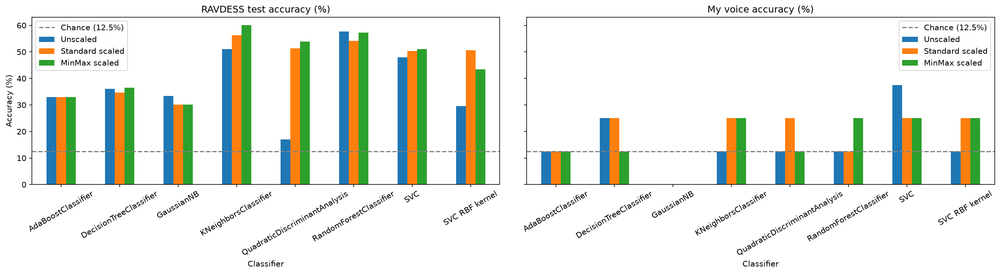
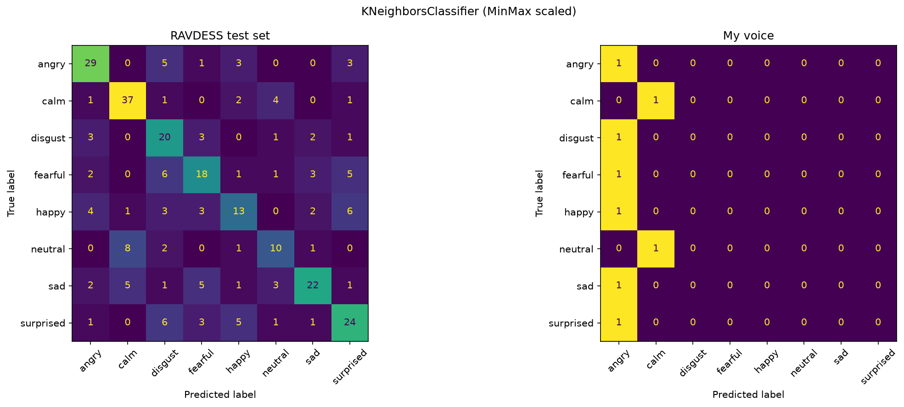
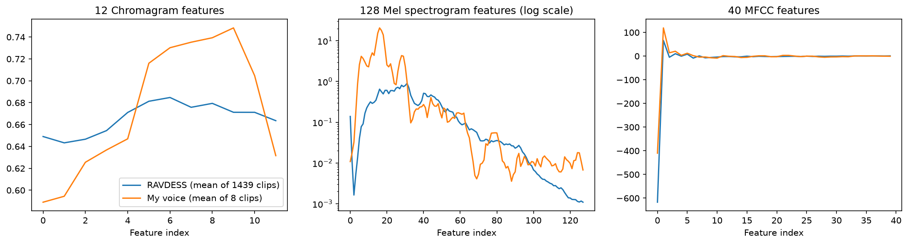

# Week 3: Classic ML Audio Emotion Classification on RAVDESS and My Voice

**Name:** Benjamin Nichiporik | **Student ID:** [ADD] | **GitHub:** Fallenfour-png | **Repository:** https://github.com/Fallenfour-png/Week3-ClassicML/tree/Ben_Assignment_3

## 1. Method

I trained the tutorial's eight classifiers (kNN, linear SVC, RBF SVC, decision tree, random forest, AdaBoost, Gaussian Naive Bayes, QDA) on 180 features per clip (12 chroma, 128 mel spectrogram, 40 MFCC) from 1439 RAVDESS clips with an 80/20 split. Each model was trained three times: unscaled, StandardScaler, and MinMaxScaler. Every version was then tested on 1) the RAVDESS test split (288 clips) and 2) my 8 recordings from last week (Actor 25, one clip per emotion, "Kids are talking by the door"). My clips were transformed with the scalers fitted on RAVDESS, never with a new scaler. I made three small fixes to the code: the tutorial's stereo-to-mono step passed audio in the wrong shape to `librosa.to_mono`, which shrank stereo files to 2 samples (all 8 of my clips are stereo); paths now work locally; and QDA got `shrinkage=0.1` because the newer scikit-learn refuses to fit 180 features with about 150 samples per class.

## 2. Results


*Figure 1. Accuracy of each model and scaling version on the RAVDESS test set (left) and my 8 clips (right). The dashed line is chance (12.5%).*

| Classifier | RAVDESS Unscaled (%) | RAVDESS Standard (%) | RAVDESS MinMax (%) | My voice Unscaled (/8) | My voice Standard (/8) | My voice MinMax (/8) |
|---|---|---|---|---|---|---|
| kNN | 51.0 | 56.3 | **60.1** | 1 | 2 | 2 |
| SVC (linear) | 47.9 | 50.3 | 51.0 | **3** | 2 | 2 |
| SVC (RBF) | 29.5 | 50.7 | 43.4 | 1 | 2 | 2 |
| Decision tree | 36.1 | 34.7 | 36.5 | 2 | 2 | 1 |
| Random forest | 57.6 | 54.2 | 57.3 | 1 | 1 | 2 |
| AdaBoost | 33.0 | 33.0 | 33.0 | 1 | 1 | 1 |
| Gaussian NB | 33.3 | 30.2 | 30.2 | 0 | 0 | 0 |
| QDA (shrinkage 0.1) | 17.0 | 51.4 | 53.8 | 1 | 2 | 1 |

**RAVDESS test set.** The best model was **kNN with MinMax scaling (60.1%)**, followed by random forest (57.6% unscaled; the tutorial's tuned forest reached 59.7%). This is close to the tutorial's Colab run (random forest 56.3%, kNN 55.9%, SVC 50.4%). The small differences come from random forests and decision trees having no fixed seed, and from the stereo fix, which changed the features of a few stereo RAVDESS files. QDA jumped from 25.7% to about 51% because the regularization stabilizes its covariance estimates. The confusion matrix (Figure 2) shows calm and angry are recognized best, while happy and neutral are often confused with surprised and calm.

**My voice.** Every model did much worse on my recordings. The best result was **linear SVC unscaled with 3/8 (37.5%)**, and most models got 1 or 2 clips right (12.5 to 25%, near chance). Gaussian NB got none. Across all 24 model/scaling combinations, my calm clip was correct 10 times, happy 8, fearful 7, angry 6 and sad 2, but neutral, disgust and surprised were never predicted correctly. Many models gave nearly every clip the same high-energy label: kNN-MinMax, the best RAVDESS model, labeled 6 of my 8 clips "angry" (Figure 2, right). Since each clip is worth 12.5%, these numbers are rough, but the drop from about 55% to about 20% is clear.


*Figure 2. Confusion matrices of the best RAVDESS model (kNN, MinMax scaled) on the RAVDESS test set and on my 8 clips.*

## 3. Scaled vs. unscaled

On RAVDESS, scaling mattered a lot for **distance- and kernel-based models**: kNN went from 51.0% to 60.1%, RBF SVC from 29.5% to 50.7%, and QDA from 17.0% to 53.8%. Unscaled, the MFCC features range from about -873 to 115 and the mel features from 0 to 149, while chroma stays between 0.3 and 0.9. A distance or RBF kernel is therefore dominated by a few large-valued MFCC and mel features, and chroma has almost no influence. Scaling gives every feature an equal say. **Tree-based models** (decision tree, random forest, AdaBoost) barely changed because each split thresholds one feature at a time, so rescaling a feature does not change which splits are possible. Gaussian NB models each feature separately, so it was also nearly unaffected. On my voice, the scaled versions were usually as good as or slightly better than unscaled (12 and 11 correct predictions in total for standard and MinMax, versus 10 unscaled), but the differences are within one clip and not reliable. Scaling cannot fix a shift in the data itself: the scaler uses RAVDESS statistics, so my unusual values become extreme scaled values instead.

## 4. Feature differences between my data and RAVDESS

```
RAVDESS (1439 clips)
Chroma: min 0.310  max 0.874   mean 0.666  sd 0.085
Mel:    min 0.000  max 149.208 mean 0.187  sd 1.598
MFCC:   min -873.2 max 115.1   mean -14.64 sd 98.55
48 kHz, mono, 3.70 s avg, RMS loudness 0.018

My voice (8 clips)
Chroma: min 0.466  max 0.802   mean 0.675  sd 0.071
Mel:    min 0.000  max 64.733  mean 1.170  sd 4.829
MFCC:   min -497.7 max 134.4   mean -7.27  sd 68.06
44.1 kHz, stereo, 3.51 s avg, RMS loudness 0.060
```


*Figure 3. Mean feature values for RAVDESS vs. my voice (mel on a log scale).*

The biggest difference is **loudness**. My recordings are about 3.3 times louder (RMS 0.060 vs. 0.018), so my average mel energy is about 6 times higher (mean 1.17 vs. 0.19), with a strong peak in the low mel bands (indices 10 to 20, roughly my male voice's fundamental and first harmonics). After standard scaling, my mel values reach 80 standard deviations, compared with a maximum of 36.5 within RAVDESS. My first MFCC (overall log energy) is also much higher (-410 vs. -617 on average). Because loud, energetic speech in RAVDESS comes from angry, fearful and happy clips, the models read my loud recordings as high-arousal emotions, which explains the many "angry" and "fearful" predictions and why calm, quiet neutral, and sad were hard. My chroma profile is also shaped differently, peaking in higher pitch classes. Other sources of mismatch: a home microphone and room instead of a studio, 44.1 kHz stereo instead of 48 kHz mono, one untrained speaker with only one take at normal intensity, and the fact that the models never heard my voice during training. Normalizing loudness before feature extraction, recording more clips in a quieter setting, or adding my clips to training would likely help the most.

## References

1. Livingstone, S. R., & Russo, F. A. (2018). The Ryerson Audio-Visual Database of Emotional Speech and Song (RAVDESS). *PLoS ONE, 13*(5), e0196391. Dataset: https://zenodo.org/record/1188976 (CC BY-NC-SA 4.0).
2. Nichiporik, B. (2026). Actor 25 voice recordings (8 clips, RAVDESS naming). OneDrive: [ADD LINK].
3. IAT-ExploringAI-2026. Week3-ClassicML tutorial notebook. https://github.com/IAT-ExploringAI-2026/Week3-ClassicML
4. McFee, B., et al. librosa: Audio and music signal analysis in Python. https://librosa.org
5. Pedregosa, F., et al. (2011). Scikit-learn: Machine learning in Python. *JMLR, 12*, 2825–2830.
